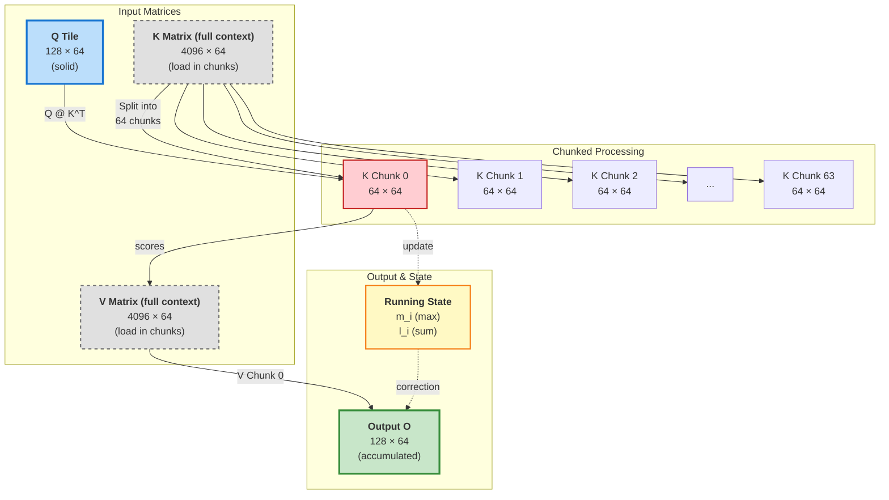
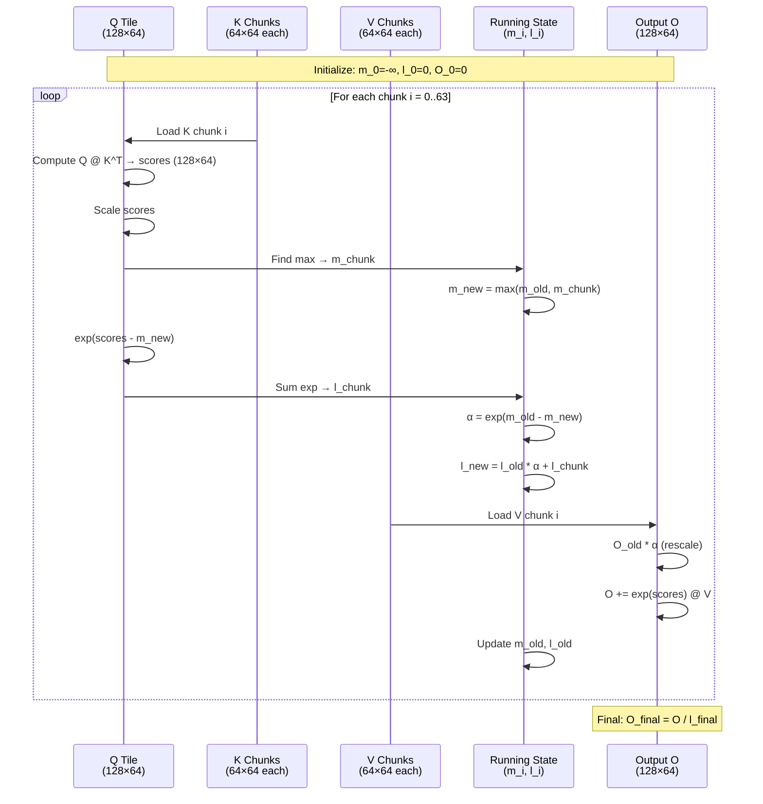
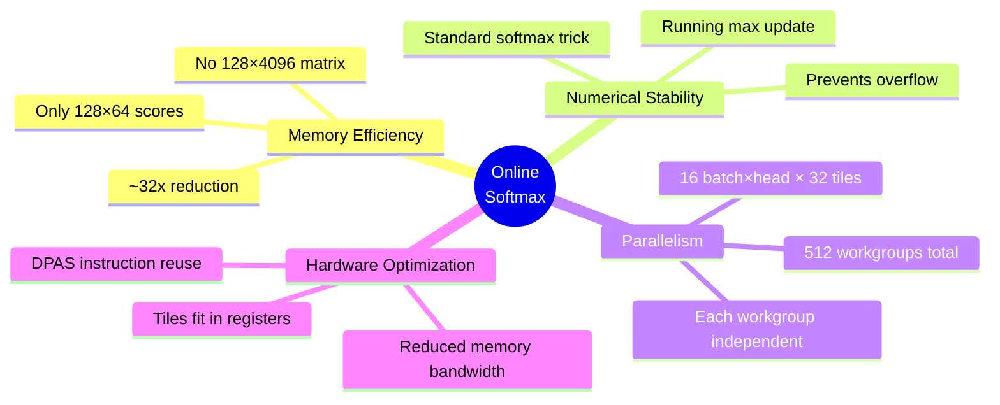
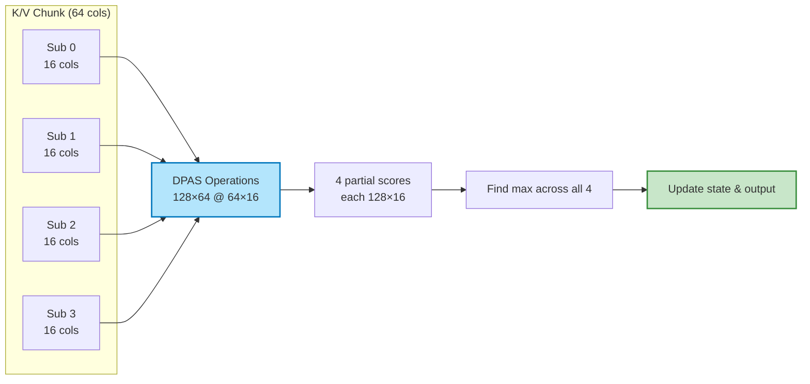
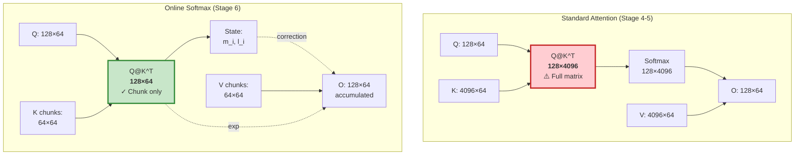

# Stage 6: Online Softmax (Fused Attention)

Process K/V in chunks to avoid materializing the full attention matrix.

## Matrix Layout Overview



## Online Softmax Algorithm Flow

```mermaid
flowchart TD
    Start([Start: Loop over chunks i=0..63]) --> Init[Initialize:<br/>m_0 = -∞<br/>l_0 = 0<br/>O_0 = 0]
    
    Init --> LoadK[Load K chunk i<br/>64 × 64]
    LoadK --> QK[Compute Q @ K^T<br/>128 × 64 @ 64 × 64<br/>= 128 × 64 scores]
    
    QK --> Scale[Scale scores<br/>scores * 1/√d_k]
    
    Scale --> MaxChunk[Find max in chunk<br/>m_chunk = max(scores)]
    MaxChunk --> UpdateMax[Update global max<br/>m_new = max(m_old, m_chunk)]
    
    UpdateMax --> ExpScores[Compute exponentials<br/>exp(scores - m_new)]
    ExpScores --> SumChunk[Sum exponentials<br/>l_chunk = Σ exp(scores)]
    
    SumChunk --> Correction[Compute correction<br/>α = exp(m_old - m_new)]
    Correction --> UpdateSum[Update sum<br/>l_new = l_old * α + l_chunk]
    
    UpdateSum --> LoadV[Load V chunk i<br/>64 × 64]
    LoadV --> RescaleO[Rescale old output<br/>O_old * α]
    RescaleO --> AccumO[Accumulate output<br/>O_new = O_old * α + exp(scores) @ V]
    
    AccumO --> Check{More<br/>chunks?}
    Check -->|Yes| LoadK
    Check -->|No| Normalize[Final normalization<br/>O_final = O_accumulated / l_final]
    
    Normalize --> End([End: Output ready])
    
    style Start fill:#e1bee7,stroke:#7b1fa2,stroke-width:2px
    style End fill:#e1bee7,stroke:#7b1fa2,stroke-width:2px
    style UpdateMax fill:#ffcdd2,stroke:#c62828,stroke-width:2px
    style UpdateSum fill:#ffcdd2,stroke:#c62828,stroke-width:2px
    style AccumO fill:#c8e6c9,stroke:#388e3c,stroke-width:2px
    style Normalize fill:#c8e6c9,stroke:#388e3c,stroke-width:2px
```

## Chunk Processing Detail



## Visual Representation of Sliding Window

```
Iteration 0:
┌─────────┐     ┌────┬────┬────┬─────────────────────────┐
│         │     │ 0  │ 1  │ 2  │ ... (64 chunks total)   │
│    Q    │  @  ├────┴────┴────┴─────────────────────────┤
│ (128×64)│     │    K Matrix (4096 × 64)                 │
│         │     │    [Chunk 0 highlighted]                │
└─────────┘     └──────────────────────────────────────────┘
                               ↓
                    ┌─────────────────────┐
                    │  Partial scores     │
                    │  Update m_0, l_0    │
                    │  Accumulate to O_0  │
                    └─────────────────────┘

Iteration 1:
┌─────────┐     ┌────┬────┬────┬─────────────────────────┐
│         │     │    │ 1  │ 2  │ ...                     │
│    Q    │  @  ├────┴────┴────┴─────────────────────────┤
│ (128×64)│     │    K Matrix (4096 × 64)                 │
│         │     │    [Chunk 1 highlighted]                │
└─────────┘     └──────────────────────────────────────────┘
                               ↓
                    ┌─────────────────────┐
                    │  Partial scores     │
                    │  Update m_1, l_1    │
                    │  Accumulate to O_1  │
                    └─────────────────────┘

... continues for 64 iterations ...
```

## Key Benefits



## Implementation Details

### Sub-chunking K and V

Each 64-column chunk is further divided into 4 sub-chunks of 16 columns:



## State Variables

| Variable | Shape | Purpose |
|----------|-------|---------|
| `m_i` | `128×1` | Running maximum value per row |
| `l_i` | `128×1` | Running sum of exponentials per row |
| `O_i` | `128×64` | Running output accumulator |
| `Q` | `128×64` | Query tile (constant per workgroup) |
| `K_chunk` | `64×64` | Current K chunk being processed |
| `V_chunk` | `64×64` | Current V chunk being processed |

## Comparison: Standard vs Online Softmax



## Mathematical Formulation

For each chunk $i$:

```math
\begin{align}
\text{scores}_i &= Q \cdot K_i^T \cdot \frac{1}{\sqrt{d_k}} \\
m_i &= \max(m_{i-1}, \max(\text{scores}_i)) \\
\alpha_i &= \exp(m_{i-1} - m_i) \\
l_i &= l_{i-1} \cdot \alpha_i + \sum \exp(\text{scores}_i - m_i) \\
O_i &= O_{i-1} \cdot \alpha_i + \exp(\text{scores}_i - m_i) \cdot V_i \\
O_{\text{final}} &= \frac{O_n}{l_n}
\end{align}
```

Where:
- $m_i$ is the running maximum
- $l_i$ is the running sum of exponentials
- $\alpha_i$ is the correction factor for previous chunks
- $O_i$ is the accumulated output
